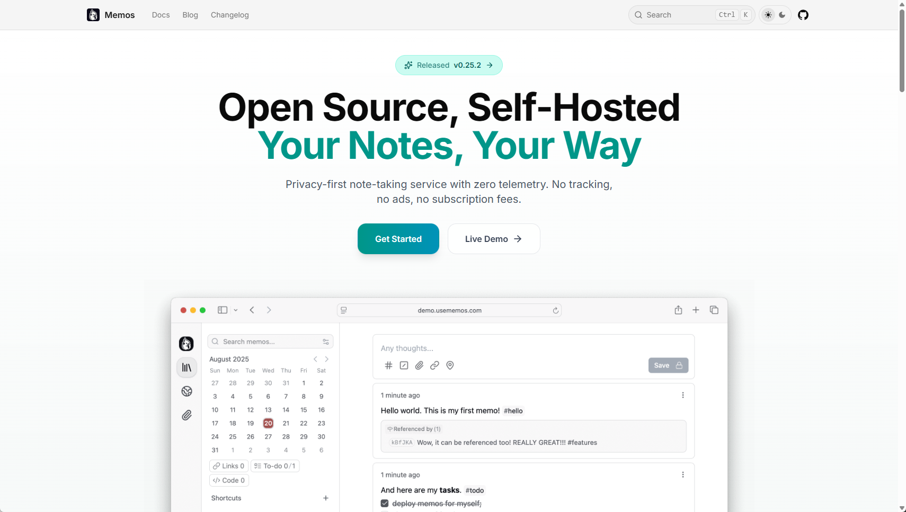

Memos 是一项隐私优先的轻量级笔记服务。轻松捕捉并分享您的精彩想法。



官网：[usememos.com](https://www.usememos.com)

仓库地址：[usememos/memos](https://github.com/usememos/memos)

Docker仓库地址：[hub.docker.com/r/neosmemo/memos](https://hub.docker.com/r/neosmemo/memos)


这款笔记服务拥有Web网页端、安卓手机端、IOS苹果端等多端，可以实现多端同时访问，同时支持多用户，附件存储支持AWS S3协议，

最新版0.25版本使用无法在IOS版本连接，需要Mortis等服务做兼容。所以会一并部署一个Mortis服务。

> Mortis - 一个用于 Moe Memos 的自托管服务器
> 
> 一个自托管服务器，为 Moe Memos 等兼容应用程序提供Memos 0.21.0 OpenAPI支持。

docker-compose方式部署


```yaml title="docker-compose.yml"
services:
  memos:
    image: neosmemo/memos:0.25.1
    container_name: memos
    hostname: memos
    ports:
      - 5230:5230
    volumes:
      - ./data:/var/opt/memos
    restart: always
    networks:
      - app-net
  mortis:
    image: ghcr.io/mudkipme/mortis:0.25.1
    container_name: mortis
    ports:
      - "5231:5231"
    entrypoint: ["/app/mortis"]
    command: ["-grpc-addr=memos:5230"]
    restart: always
    depends_on:
        - memos
    networks:
      - app-net
networks:
  app-net:
    external: true

```

附件存储使用minio的配置方式
> 文件路径模板：assets/{timestamp}{filename}
> 
> Access key id：Pv3g48CROtTIN7Pqfe9J
> 
> Access key secret：ID3BMPd9vKPO7XTwi40yKCtCNJkLGf0yAw2fkFRS
> 
> Endpoint：https://io.jianglin.cc:8443
> 
> Region：memos
> 
> Bucket：memos
> 
> Use Path Style：Y