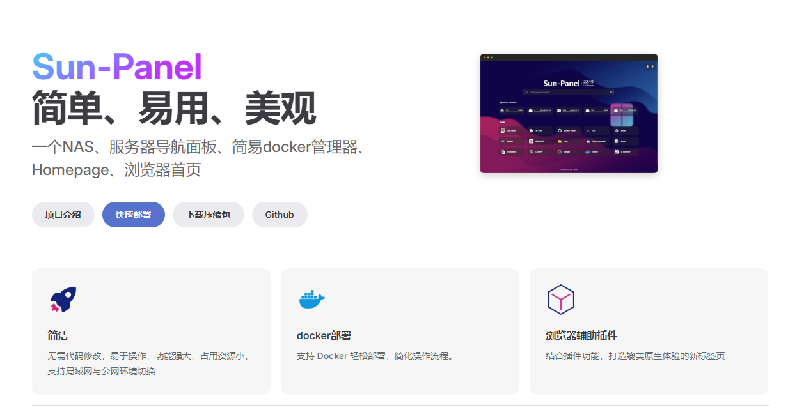

一个NAS、月服务器导航面板、简易docker管理器、Homepage、浏览器首页



首页：[Sun-Panel](https://doc.sun-panel.top/zh_cn/)

github：[sun-panel - GitHub](https://github.com/hslr-s/sun-panel)

默认账号密码
账号： [admin@sun.cc](mailto:admin@sun.cc) 
密码：12345678

部署教程：[https://doc.sun-panel.top/zh_cn/usage/quick_deploy.html](https://doc.sun-panel.top/zh_cn/usage/quick_deploy.html)

## 安装

### docker-compose配置文件

```yaml title="docker-compose.yml"
services:
  panel:
    image: 'docker.olinl.com.cn/hslr/sun-panel:latest'
    hostname: panel
    container_name: panel
    ports:
      - '3002:3002'
    volumes:
      - './conf:/app/conf'
      - '/var/run/docker.sock:/var/run/docker.sock' # 挂载docker.sock
      # - ./runtime:/app/runtime # 挂载日志目录
      # - /mnt/sata1-1:/os # 硬盘挂载点（根据自己需求修改）
    restart: always
# 个人配置
    networks:
      - net
networks:
  net:
    external: true
    name: lin-net
```

### 配置文件

如果使用mysql/redis，找到项目的[配置文件](https://doc.sun-panel.top/zh_cn/advanced/config.html

```yaml
# ======================
# Basic configuration
# ======================
[base]
# Web run port. Default:3002
http_port=3002
# Database driver [mysql/sqlite(Default)]
database_drive=mysql
# Cache driver [redis/memory(Default)]
cache_drive=redis
# Queue driver [redis/memory(Default)]
queue_drive=redis
# File cache path (Please start with the current path './')
# Warning: The files that have been uploaded after the modification cannot be accessed
source_path=./uploads
# File cache path.
source_temp_path=./runtime/temp

# ======================
# Mysql database driver
# ======================
[mysql]
host=127.0.0.1
port=3306
username=root
password=root
db_name=sun_panel
wait_timeout=100

# ======================
# sqlite database driver
# ======================
[sqlite]
file_path=./database/database.db

# ======================
# redis database driver
# ======================
[redis]
address=127.0.0.1:6379
password=
prefix=sun_panel:
db=0
```

## 美化

### 添加毛玻璃效果

```css
/* 分组毛玻璃 */
.item-list{
  backdrop-filter: blur(1px); /* 毛玻璃效果 */
  -webkit-backdrop-filter: blur(1px); /* 对于 Safari 等 WebKit 浏览器 */
  background: rgba(255, 255, 255, 0.3); /* 半透明背景色 */
  border-radius: 15px;
  box-shadow: 0 4px 30px rgba(0, 0, 0, 0.1);
  border: 1px solid rgba(255, 255, 255, 0.2);
  padding: 10px;
  color: white;
  margin: auto;
}
```

### 在首页添加三张图片

```javascript

/* 搜索下方三张图片 */
document.addEventListener('DOMContentLoaded', () => {
    // 创建一个 MutationObserver 实例，监听 DOM 的变化
    const observer = new MutationObserver((mutationsList) => {
        // 查找目标父容器
        const parentDiv = document.querySelector('#item-card-box');

        // 如果找到了目标父容器，则停止观察并执行后续逻辑
        if (parentDiv) {
            observer.disconnect(); // 停止观察

            // 图片链接数组和对应的点击链接数组
            const imageLinks = [
                { src: "https://t.alcy.cc/moez?t=1", href: "#" },
                { src: "https://t.alcy.cc/moez?t=2", href: "#" },
                { src: "https://t.alcy.cc/moez?t=3", href: "#" }
            ];

            // 创建一个新的 div 容器
            const newDiv = document.createElement('div');
            newDiv.classList.add('image-container'); // 添加样式类

            // 遍历图片链接数组，动态创建图片和链接元素
            imageLinks.forEach((item, index) => {
                const a = document.createElement('a'); // 创建 a 标签
                a.href = item.href; // 设置链接地址
                a.classList.add('image-link'); // 添加链接样式类

                const img = document.createElement('img'); // 创建 img 标签
                img.src = item.src; // 设置图片地址
                img.alt = `Image ${index + 1}`; // 设置图片描述
                img.classList.add('image-item'); // 添加图片样式类

                // 如果是第三个图片，添加点击事件
                // if (index === 2) {
                //     img.addEventListener('click', (event) => {
                //         event.preventDefault(); // 阻止默认跳转行为
                //         alert("点上瘾了是吧，这个啥也没有！"); // 自定义点击逻辑
                //     });
                // }

                // 将 img 添加到 a 标签内
                a.appendChild(img);
                // 将 a 标签添加到新 div 中
                newDiv.appendChild(a);
            });

            // 将新 div 插入到目标父容器中
            if (parentDiv.firstChild) {
                parentDiv.insertBefore(newDiv, parentDiv.firstChild); // 插入到第一个子元素前
            } else {
                parentDiv.appendChild(newDiv); // 如果没有子元素，直接追加
            }
        }
    });

    // 开始观察整个文档的变化
    observer.observe(document.body, { childList: true, subtree: true });
});
```

css

```css
/* 搜索下方三张图片 */
/* 容器样式 */
.image-container {
    display: flex;
    justify-content: center; /* 水平居中 */
    align-items: center; /* 垂直居中 */
    gap: 50px; /* 图片之间的间距 */
    margin: 20px 0; /* 上下外边距 */
    flex-wrap: wrap; /* 当空间不足时换行 */
}

/* 图片链接样式 */
.image-link {
    text-decoration: none; /* 去掉下划线 */
    border-radius: 28px; /* 圆角 */
    overflow: hidden; /* 防止图片溢出 */
    box-shadow: 0 4px 8px rgba(0, 0, 0, 0.2); /* 阴影效果 */
    transition: transform 0.3s ease; /* 平滑过渡 */
}

/* 图片样式 */
.image-item {
    width: 350px; /* 固定宽度 */
    height: 200px; /* 自适应高度 */
    border-radius: 28px; /* 圆角 */
    transition: transform 0.3s ease; /* 平滑过渡 */
}

/* 鼠标悬停时的效果 */
.image-link:hover .image-item {
    transform: scale(1.1) rotate(5deg); /* 放大并旋转 */
    box-shadow: 0 8px 16px rgba(0, 0, 0, 0.3); /* 加深阴影 */
}

/* Media Query for mobile devices */
@media (max-width: 768px) {
    /* 在小屏幕上，使图片竖排 */
    .image-container {
        flex-direction: column; /* 竖向排列 */
        align-items: center; /* 居中对齐 */
        gap: 20px; /* 减少间距 */
    }

    /* 调整图片大小以适应小屏幕 */
    .image-item {
        width: 100%; /* 宽度为100% */
        max-width: 400px; /* 设置最大宽度 */
    }
}
```
### 添加鼠标悬停动画

```css
/*鼠标悬停动画 */

/* 当鼠标悬停在图标信息框上时触发动画 */
/* 详细图标摇晃动画 */
.icon-info-box .rounded-2xl:hover {
    background: rgba(42, 42, 42, 0.7) !important;/* 背景颜色变成深灰色 */
    -webkit-animation: info-shake-bounce .5s alternate !important;
    -moz-animation: info-shake-bounce .5s alternate !important;
    -o-animation: info-shake-bounce .5s alternate !important;
    animation: info-shake-bounce .5s alternate !important;
}


/* 小图标摇晃动画 */
.icon-small-box .rounded-2xl:hover {
    background: rgba(42, 42, 42, 0.7) !important;/* 背景颜色变成深灰色 */
    -webkit-animation: small-shake-bounce .5s alternate !important;
    -moz-animation: small-shake-bounce .5s alternate !important;
    -o-animation: small-shake-bounce .5s alternate !important;
    animation: small-shake-bounce .5s alternate !important;
}


/* 定义摇详细图标晃弹跳动画的关键帧 */
@keyframes info-shake-bounce {

    0%,
    100% {
        transform: rotate(0);
    }

    25% {
        transform: rotate(10deg);
    }

    50% {
        transform: rotate(-10deg);
    }

    75% {
        transform: rotate(2.5deg);
    }

    85% {
        transform: rotate(-2.5deg);
    }
}


/* 定义摇小图标晃弹跳动画的关键帧 */
@keyframes small-shake-bounce {

    0%,
    100% {
        transform: rotate(0);
    }

    25% {
        transform: rotate(15deg);
    }

    50% {
        transform: rotate(-15deg);
    }

    75% {
        transform: rotate(5deg);
    }

    85% {
        transform: rotate(5deg);
    }
}
```