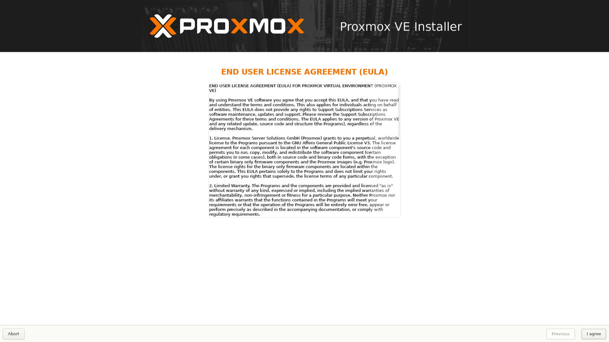
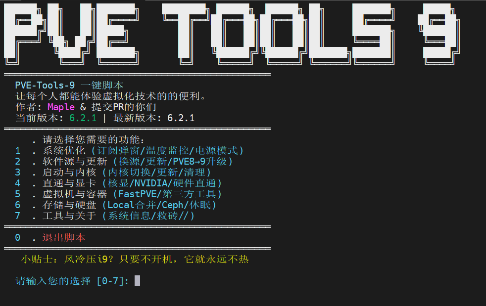
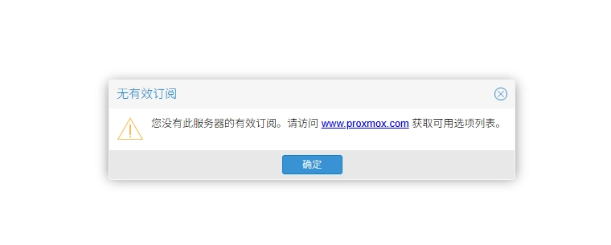

PVE 下载地址：https://www.proxmox.com/en/downloads

PVE 9.x  下载地址/仓库：https://enterprise.proxmox.com/iso/

将 ISO 文件下载下来，然后正常安装。

~~如果你连安装都不会，我劝你放弃使用 Pve 系统或者观看其他从零开始的教程。~~

安装完成后，进入配置阶段

## 使用脚本配置

这里使用的是 [Mapleawaa](https://github.com/Mapleawaa) 大佬的脚本[PVE-Tools-9](https://github.com/Mapleawaa/PVE-Tools-9)



优点：可以全程不管 github，将脚本下载下来导入机器，在脚本运行的时候会引导用户选择地区源，后续也不需要为网络环境担心。

```bash
# 1. 下载脚本
wget https://raw.githubusercontent.com/Mapleawaa/PVE-Tools-9/main/PVE-Tools.sh

# 2. 添加执行权限
chmod +x PVE-Tools.sh

# 3. 运行脚本
./PVE-Tools.sh
```


这里使用的功能：

```bash :collapsed-lines
# 更新软件包(必须！)
2  . 软件源与更新 (换源/更新/PVE8→9升级)
	1  . 更换软件源
		2) 使用镜像站安全源 (速度快，但可能有延迟)
	2  . 更新系统软件包

# 更新内核（可选）
3  . 启动与内核 (内核切换/更新/清理)
	1  . 内核管理 (内核切换/更新/清理)
		2  . 查看可用内核列表
			可用内核版本：
			• proxmox-kernel-6.17.4-2-pve
			• proxmox-kernel-6.17.9-1-pve
			• proxmox-kernel-xxxX
			复制最新的那一个 如：proxmox-kernel-6.17.9-1-pve
		3  . 安装新内核
			请输入内核标识: 3  . proxmox-kernel-6.17.9-1-pve
		4  . 设置默认启动内核 # 输入最新的内核
			请输入要设置为默认的内核版本 (例如: 6.8.8-1-pve): 6.17.9-1-pve
		6  . 重启系统应用新内核
		
#Intel 核显 SR-IOV 虚拟化(可选)
# 注意，此操作是Intel 11-15代 SR-IOV 核显虚拟化，详细情看脚本说明
4  . 直通与显卡 (核显/NVIDIA/硬件直通)
	1  . Intel 核显虚拟化管理 (SR-IOV/GVT-g)
		1  . Intel 11-15代 SR-IOV 核显虚拟化
     		支持: Rocket Lake, Alder Lake, Raptor Lake
     		特性: 最多 7 个虚拟核显，性能较好
     		
     		确认操作: 确认继续配置 SR-IOV 核显虚拟化
			请输入 'yes' 确认继续，其他任意键取消 [N]: yes
			
			# 这里 i915-sriov-dkms 仓库的 2026.02.04 版本号有问题，使用后一个版本
			请输入要安装的 release 版本号 [默认: 2025.11.10]: 2025.12.10
			
			请输入 VFs 数量 [1-7, 默认: 3]:
			
			确认操作: 是否现在重启系统
			请输入 'yes' 确认继续，其他任意键取消 [N]: yes

# 重启完成输入 lspci
lspci

root@pve:~# lspci
00:00.0 Host bridge: Intel Corporation Device a704 (rev 01)
00:02.0 VGA compatible controller: Intel Corporation Raptor Lake-S GT1 [UHD Graphics 770] (rev 04)
00:02.1 VGA compatible controller: Intel Corporation Raptor Lake-S GT1 [UHD Graphics 770] (rev 04)
00:02.2 VGA compatible controller: Intel Corporation Raptor Lake-S GT1 [UHD Graphics 770] (rev 04)
00:02.3 VGA compatible controller: Intel Corporation Raptor Lake-S GT1 [UHD Graphics 770] (rev 04)
00:02.4 VGA compatible controller: Intel Corporation Raptor Lake-S GT1 [UHD Graphics 770] (rev 04)
00:02.5 VGA compatible controller: Intel Corporation Raptor Lake-S GT1 [UHD Graphics 770] (rev 04)
00:02.6 VGA compatible controller: Intel Corporation Raptor Lake-S GT1 [UHD Graphics 770] (rev 04)
00:02.7 VGA compatible controller: Intel Corporation Raptor Lake-S GT1 [UHD Graphics 770] (rev 04)
00:06.0 PCI bridge: Intel Corporation Raptor Lake PCIe 4.0 Graphics Port (rev 01)
...


# 系统优化操作（可选）
1  . 系统优化 (订阅弹窗/温度监控/电源模式)
	1  . 删除订阅弹窗
	2  . 温度监控管理 (CPU/硬盘监控设置)
		1  . 配置温度监控 (CPU/硬盘温度显示)
			如果没有 UPS 设备或不想显示，请选择 N，默认Y）(y/N): N
			
			请输入选项 [1-2] (直接回车使用自动计算): 1
	3  . CPU 电源模式配置
		#根据需要自行配置，后续可在这里修改

6  . 存储与硬盘 (Local合并/Ceph/休眠)
	# pve安装完默认有2个分区，这里可以合并成一个
	1  . 合并 local 与 local-lvm
	# Ceph为分布式存储组件，这里可以直接卸载，或者安装、换源
	2  . Ceph 管理 (安装/卸载/换源)


```


::: caution

在使用 SR-IOV 的时候会脚本会自动更新内核版本，推荐在这之前先将内核版本更新到最新

:::


## 手搓

### 换源

```bash

# 删除或备份配置
rm -rf /etc/apt/sources.list.d/ 

# 写入
cat > /etc/apt/sources.list << EOF
deb https://mirrors.ustc.edu.cn/debian/ trixie main contrib non-free non-free-firmware
deb https://mirrors.ustc.edu.cn/debian/ trixie-updates main contrib non-free non-free-firmware
deb https://mirrors.ustc.edu.cn/debian/ trixie-backports main contrib non-free non-free-firmware
deb https://mirrors.ustc.edu.cn/debian-security trixie-security main
deb https://mirrors.ustc.edu.cn/proxmox/debian trixie pve-no-subscription
EOF

# 更新原
apt update

```

### 配置 SR-IOV

仓库地址：[i915-sriov-dkms](https://github.com/strongtz/i915-sriov-dkms)

```bash
# 修改grub文件
nano /etc/default/grub
GRUB_CMDLINE_LINUX_DEFAULT="quiet" # [!code --]
GRUB_CMDLINE_LINUX_DEFAULT="quiet intel_iommu=on iommu=pt i915.enable_guc=3 i915.max_vfs=7 module_blacklist=xe" # [!code ++]

# 更新grub
update-grub

# 安装编译所需组件
apt install -y build-essential git dkms sysfsutils proxmox-headers-$(uname -r) intel-gpu-tools

# 下载i915-sriov-dkms
## 这里需要去 https://github.com/strongtz/i915-sriov-dkms/releases 获取最新版本 
## 注意！2026.02.04 版本 在连接监视器时将导致内核oops，可以使用前一版本 2025.12.10
wget https://github.com/strongtz/i915-sriov-dkms/releases/download/2025.12.10/i915-sriov-dkms_2025.12.10_amd64.deb

# 安装

dpkg -i i915-sriov-dkms_*_amd64.deb

# 重启后手动创建测试- 创建7个
reboot
echo 7 > /sys/devices/pci0000:00/0000:00:02.0/sriov_numvfs
lspci

# 永久配置
## 这里的7 就是创建7个，SR-IOV最大允许创建7个
echo "devices/pci0000:00/0000:00:02.0/sriov_numvfs = 7" >> /etc/sysfs.conf

```

然后就可以开始愉快的使用了！

重要提示：

- 物理核显 (00:02.0) 不能直通给虚拟机
- 只能直通虚拟核显 (00:02.1 ~ 00:02.7)
- 虚拟机需要勾选 ROM-Bar 和 PCIE 选项

### 删除订阅弹窗

尽管我们使用的 PVE 是免费版，但如果你没有订阅，每次访问网页时，都会有一个“无有效订阅”的弹窗



弹窗代码在 `/usr/share/javascript/proxmox-widget-toolkit/proxmoxlib.js` 中，通过 `void({...})` 可以让弹窗部分代码不执行，实现删除弹窗的效果。

因此，直接执行以下命令即可实现删除订阅弹窗

```bash
sed -Ezi.bak "s/(Ext.Msg.show\(\{\s+title: gettext\('No valid sub)/void\(\{ \/\/\1/g" /usr/share/javascript/proxmox-widget-toolkit/proxmoxlib.js 

systemctl restart pveproxy.service
```

### 合并 local 与 local-lvm

PVE 安装过程中会自动创建 `local` 和 `local-lvm`，如果你的系统盘不够大，可能会出现一个用满了，另一个却比较空的情况，提前将两者合并就可以避免出现这种尴尬的情况。

1. 删除 `local-lvm` 分区

```
lvremove /dev/pve/data
```

2. 扩容 local

```
lvextend -l +100%FREE /dev/pve/root
```

3. 扩展文件系统

```
resize2fs /dev/pve/root
```

4. 在 Web UI 上删除 local-lvm，然后编辑 local 勾选所有内容 

	点击数据中心-> 存储  local-lvm 点击移除，点击 local 勾选所有 `内容 `


## 其他

### qemu-guest-agent

安装虚拟机插件，使 pve 控制台性能监控更加准确

**Linux**

```bash
# 对于Ubuntu/Debian
apt install -y qemu-guest-agent # [!code warning]
# 对于Centos
yum install -y qemu-guest-agent # [!code warning]

systemctl enable qemu-guest-agent
systemctl start qemu-guest-agent
systemctl status qemu-guest-agent

```


**Windows**

Windows 不包含对 VirtIO 设备的原生支持。 不过，[virtio-win](https://virtio-win.github.io/) 项目提供的开源驱动提供了极佳的外部支持，这些驱动程序已编译并签名支持Windows。

Virtio-win 项目定期发布新版本的 Virtio-win 驱动。以下virtio-win仓库提供了Virtio-Win驱动的最新及较旧版本：

[https://fedorapeople.org/groups/virt/virtio-win/direct-downloads/archive-virtio/?C=M;O=D](https://fedorapeople.org/groups/virt/virtio-win/direct-downloads/archive-virtio/?C=M;O=D)

- 安装 ISO 里面的 `virtio-win-gt-x 64 ` 即可
- （可选）使用virtio-win-guest tools向导安装QEMU访客代理和SPICE代理，以提升远程查看体验。
