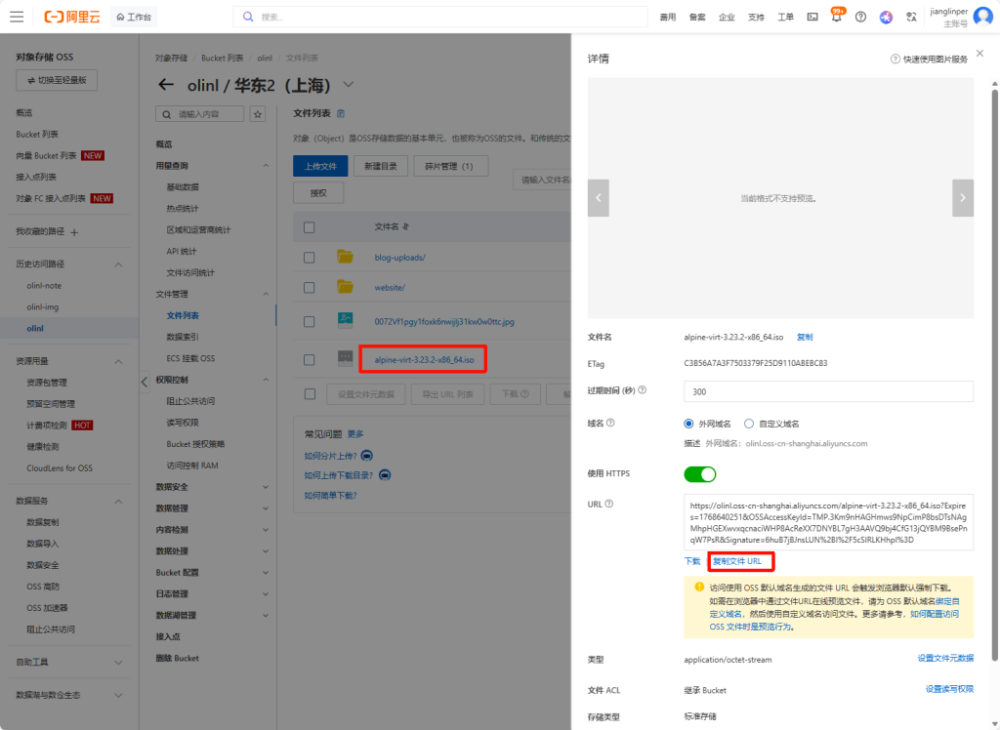
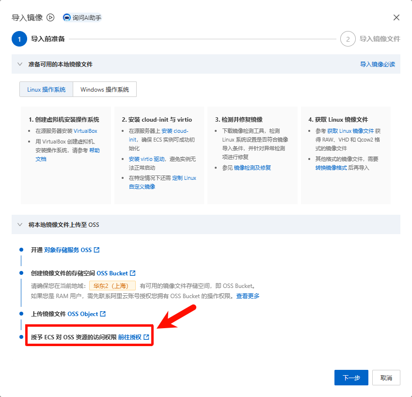
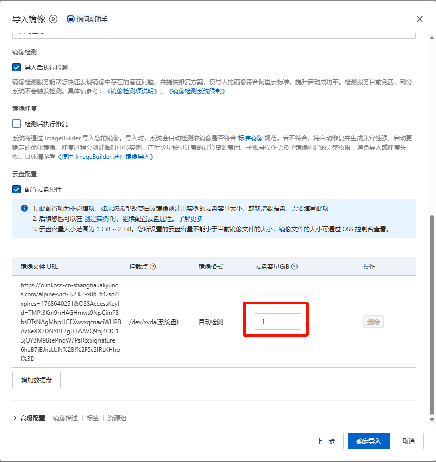

该文章已迁移至 Olinl Blog，点击[前往](https://blog.olinl.com/posts/linux-alpine/)查看

起因：站长的服务都是部署在家里，通过Frp映射到公网上的，最近有服务器要到期了，研究了下阿里云的ECS计费，决定使用一款轻量级的Linux系统，购买阿里云 2vCPU 0.5GB的服务器，3年仅需300多，如果使用学生优惠券，基本免费。带宽按量付费，使用CDT（云数据传输），国内每个月20G免费流量，境外每个月220G免费流量。

然而，在 2vCPU 0.5GB 这个“螺蛳壳里做道场”的极限配置下，我们熟悉的 CentOS、Ubuntu 甚至 Debian 都显得有些“富态”了。它们安装后动辄占用数百 MB 内存，留给应用本身的空间已然不多。

**我们的目标非常明确：在有限的资源内，榨干每一分性能。** 这时，一个专为资源受限环境而生的系统进入了视野——**Alpine Linux**。它基础运行内存仅需 **5-10 MB**，安装后硬盘占用不到 **100 MB**，恰恰是这种超轻量级服务器的“天作之合”。选择 Alpine，不是追逐潮流，而是在极致性价比方案下的**必然技术选择**。

## 开始安装

Alpine 60M镜像链接

```sql
https://dl-cdn.alpinelinux.org/alpine/v3.23/releases/x86_64/alpine-virt-3.23.2-x86_64.iso
```

### 阿里云添加自定义镜像

因为阿里云不提供Alpine的镜像，我们要使用自定义镜像，下面跟我一起配置吧

1) 将镜像上传至阿里云OSS

> 由于我们需要自定义镜像，但是镜像又必须要通过OSS提供，所以我们需要临时性的创建一个OSS Bucket实例，来上传我们的ISO镜像。在实例成功创建后，我们可以将其删除，以避免不必要的扣费

首先，来到 [OSS管理控制台](https://oss.console.aliyun.com/index) ，创建一个 Bucket，地域一定要选你服务器所在的区域 ，并且上传ISO，最后，复制URL备用



2) 导入镜像

前往 [云服务器管理控制台](https://ecs.console.aliyun.com/image/region/cn-shanghai) ，选择到所属的地区，然后选择右上角的 导入镜像


注意，需要授权ECS访问OSS业务




然后正常填写，**取消勾选“导入后执行检测”** ，先不要点下一步

接下来勾选配置云盘属性，并且将 **云盘容量设置为1GB** ，确认无误，导入



### 安装Alpine系统
> 如果你使用阿里云自定义镜像进行安装了，需要使用vnc远程链接进行安装系统，别家的厂商也是一样。
> 
> 进入 云服务器管理控制台 选择你刚买的ECS，接下来点击 远程连接 ，展开更多，选择 通过VNC远程连接

接下来就是愉快的敲命令环节~ （方括号内为默认值，你可以输入新值回车覆盖也可以直接回车应用默认值）

- 启动 Alpine 安装程序

```sql
localhost:~# setup-alpine
```

- 选择键盘布局

```sql
Select keyboard layout: [none] us
Select variant: [us]
```

- 设置主机名

```sql
Enter system hostname (fully qualified form, e.g. 'foo.example.org') [localhost] alpine-vps
```

- 设置网卡

```sql
Available interfaces are: eth0 lo
Which one do you want to initialize? [eth0]
```

- 设置 IP 获取方式

```sql
Ip address for eth0? (or 'dhcp', 'none', 'manual') [dhcp]
```

- 是否进行手动网络配置

```sql
Do you want to do any manual network configuration? [no]
```

- 设置 root 密码（输入时不会显示）

```sql
New password:
Retype password:
```

- 设置时区，或者（PRC）

```sql
Which timezone are you in? ('?' for list) [UTC] Asia/Shanghai
```

- 设置代理

```sql
HTTP/FTP proxy URL? [none]
```

- 选择软件仓库镜像。这个地方建议先输入 `s` 列出所有镜像，然后上下翻找找到阿里云镜像源，然后输入对应镜像源编号，否则如有选错

```sql
Which mirror do you want to use? (or '?' or 'done') [44] 
```

- 不创建普通用户

```sql
Setup a user? (enter a username, or 'no') [no] no
```

- 选择 SSH 服务

```sql
Which SSH server? ('openssh', 'dropbear', or 'none') [openssh]
```

- 是否允许 root 通过 SSH 登录

```sql
Allow root ssh login? ('?' for help) [prohibit-password] yes
```

- 没有找到磁盘，是否安装至 vda 云盘，是
```sql
No disk available, Try boot media /media/vda ? (y/n) [n] y
```

- 选择要安装的磁盘

```sql
Which disk(s) would you like to use? (or '?' for help or 'none') [none] vda
```

- 选择磁盘使用方式

```sql
How would you like to use it? ('sys', 'data', 'crypt', 'lvm') [sys]
```

- 确认格式化磁盘

```sql
WARNING: Erase the above disk(s) and continue? [y/N] y
```

- 安装系统

```sql
Installing system on /dev/sda:
  Installing alpine-base...
  Installing busybox...
  Installing openssh...
  Installing openrc...
```

- 安装完成提示

```sql
Installation is complete. Please reboot.
```

- 重启系统

```sql
localhost:~# reboot
```