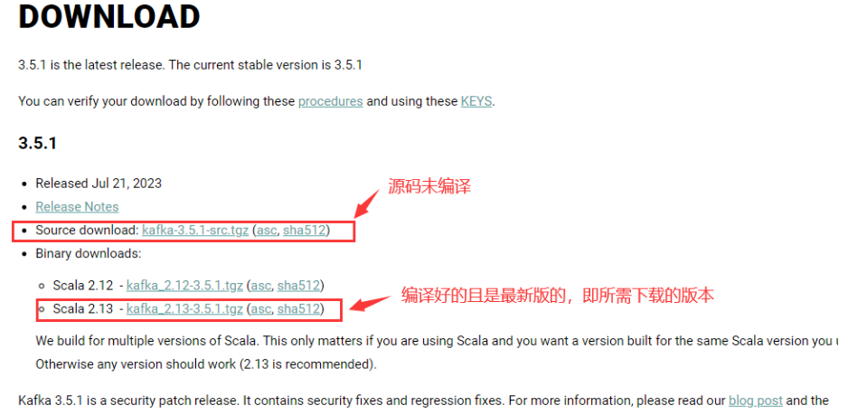

仅复制教程，未验证可行性

地址：[https://kafka.apache.org/downloads](https://kafka.apache.org/downloads)



# 安装

因为选择下载的是 .zip 文件，直接跳过安装，一步到位。

选择在任一磁盘创建空文件夹（不要使用中文路径），解压之后把文件夹内容剪切进去（本人选择 D:\env-java\路径下，即完成安装）。

linux解压命令 `tar -zxvf kafka_2.13-xxx.tgz`，linux环境下指令是在\kafka_2.13-3.5.1\bin目录。

windows直接解压即可，windows环境下指令是在kafka_2.13-3.5.1\bin\windows目录。

注意：不同系统指令所在的目录不同。

执行命令当前目录 `D:\env-java\kafka_2.13-3.5.1`

# 修改配置

修改 kafka-server 和zookeeper配置

进入到目录：`kafka_2.13-3.5.1/config/server.properties` 以及 `kafka_2.13-3.5.1/config/zookeeper.properties`

```bash
# linux系统
broker.id=1
log.dir=/opt/kafka/logs


# windows系统
broker.id=1
log.dirs=/env-java/kafka_2.13-3.5.1/kafka-logs
# /：表示当前的根路径，即D盘。没有就会创建对应的文件夹。
```

# 启动服务

```bash
# 启动ZooKeeper
## linux系统
bin/zookeeper-server-start.sh -daemon config/zookeeper.properties

## windows系统
bin\windows\zookeeper-server-start.bat config\zookeeper.properties


# 启动kafka
## linux系统
bin/kafka-server-start.sh config/server.properties

## windows系统
bin\windows\kafka-server-start.bat config\server.properties
```

**后台启动命令**

```bash
# 方式1
cd /opt/kafka
nohup bin/kafka-server-start.sh config/server.properties 2>&1 &

# 方式2
cd /opt/kafka
bin/kafka-server-start.sh -daemon config/server.properties
```

# 使用

```bash
# 创建主题
## linux系统
bin/kafka-topics.sh --create --bootstrap-server localhost:9092 --replication-factor 1 --partitions 1 --topic test
## windows系统
bin\windows\kafka-topics.bat --create --bootstrap-server localhost:9092 --replication-factor 1 --partitions 1 --topic test

# 删除主题
## linux系统
bin/kafka-topics.sh --delete --bootstrap-server localhost:9092 --topic test
## windows系统
bin\windows\kafka-topics.bat --delete --bootstrap-server localhost:9092 --topic test

# 查看Topic 列表
## linux系统
bin/kafka-topics.sh --list --bootstrap-server localhost:9092
## windows系统
bin\windows\kafka-topics.bat --list --bootstrap-server localhost:9092

# 启动 Producer
## linux系统
bin/kafka-console-producer.sh --broker-list localhost:9092 --topic test
## windows系统
bin\windows\kafka-console-producer.bat --broker-list localhost:9092 --topic test

# 启动 Consumer
## linux系统
bin/kafka-console-consumer.sh --bootstrap-server localhost:9092 --topic test --from-beginning
## windows系统
bin\windows\kafka-console-consumer.bat --bootstrap-server localhost:9092 --topic test --from-beginning

# 查看Topic 相关信息（test）
## linux系统
bin/kafka-topics.sh --describe --bootstrap-server localhost:9092 --topic test
## windows系统
bin\windows\kafka-topics.bat --describe --bootstrap-server localhost:9092 --topic test

# 删除Topic 数据（test）
## linux系统
bin\windows\kafka-delete-records.sh--bootstrap-server localhost:9092 --offset-json-file \delete_script.json
## windows系统
bin\windows\kafka-delete-records.bat --bootstrap-server localhost:9092 --offset-json-file d:\delete_script.json

##delete_script.json文件内容为##
{
    "partitions": [
        {
            "topic": "test",
            "partition": 0,
            "offset": -1
        }
    ]
}
```