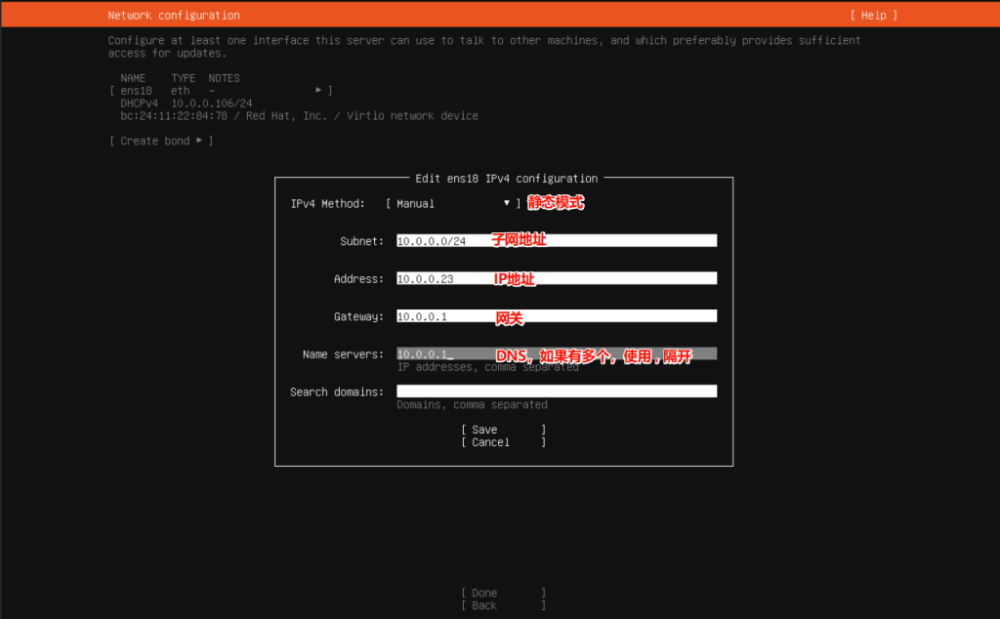
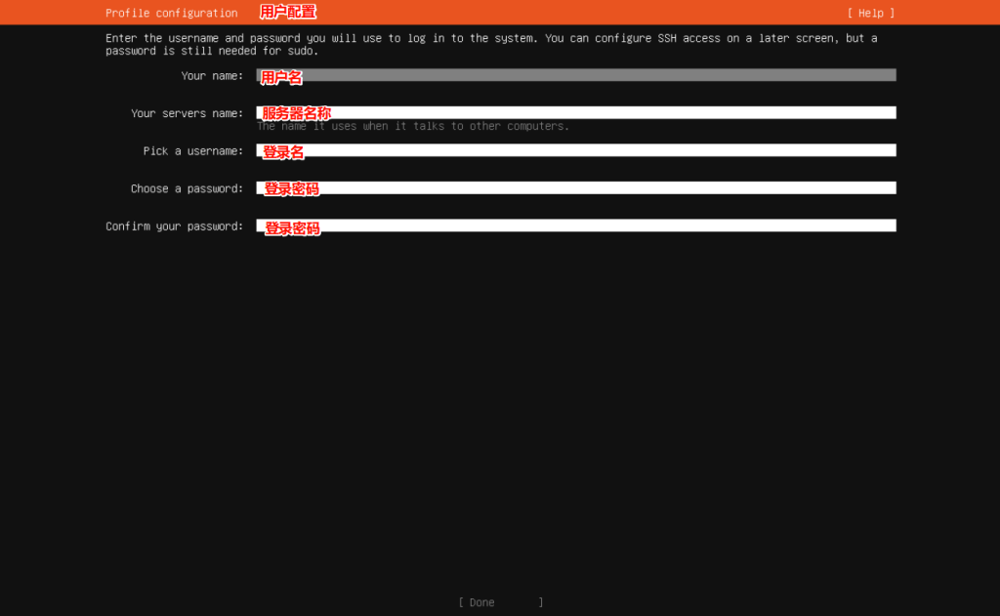

红帽官方宣布CentOS 8于2021年年底结束维护。CentOS 已死！＂免费＂的 RHEL 没了…

在本教程中，我们将引导您逐步安装 Ubuntu 服务器 24.04 LTS。

当然，此教程也适用于Ubunut Server 22.04 LTS

## 下载镜像

去Ubuntu官网找到Ubuntu Server的镜像文件（[Ubuntu官网](https://ubuntu.com/download/server))），按照自己的需求下载 iso文件

历史镜像地址：[Ubuntu-releases](https://releases.ubuntu.com/)

**制作启动盘**

可选用的工具有：

- [Rufus](https://rufus.ie/zh/)
- [**Etcher**](https://etcher.balena.io/)
- [**Ventoy**](https://www.ventoy.net/cn/index.html)

**随后重启系统，启动至U盘内的安装程序**

## 系统安装

_没必要一步截一张图片，以文字为主。_

1）进入到安装界面，默认选择第一项， Try orInstall Ubuntu Server -> 回车

2）等待进入语言选择界面，因为没有中文，所以直接选择English 回车进入

3）进入键盘配置界面，回车进入

4）选择安装类型：

- 完整安装：默认安装包含一组精心策划的软件包，为操作您的服务器提供舒适的体验
- 最小化安装：本已被定制为在人类不期望登录的环境中具有较小的运行时足迹。

_这里推荐使用完整安装，因为最小化安装的组件是不全的。如果想要极简的linux系统，可以使用Alpine，最小。_

5）配置网络，这里会展示出机器所有的网口，选中一个网口，在弹出的右侧框里面，选择 **Edit IPv4** 回车配置ipv4地址

进行静态IP配置

:::note 解释下是什么意思

**Automatic**：DHCP模式，由路由器分配IP地址，但是地址可能会随着重启变化

**Manual**：静态IP模式

- **Subnet**：为子网IP，通常为xxx.xxx.xxx.0/24
- **Address**：为IP地址，通常为xxx.xxx.xxx.xxx，填写局域网内不冲突的ip地址
- **Gateway**：网关IP地址，通常为xxx.xxx.xxx.1
- **Name servers**：DNS地址

:::

填写完成之后，按**Tab**键，选择 **Save** 回车，看到地址更改后，选择**Done** 进入下一界面



6）配置代理地址，通常情况下不需要配置

7）配置镜像源，这里推荐使用清华大学镜像源，官方的源有点慢，填完之后回车进行验证

```sql
# 清华大学镜像源
http://mirrors.tuna.tsinghua.edu.cn/ubuntu
```

8）配置硬盘，一般不需要配置，直接回车下一步，然后选择Continue即可

_PS：_ 这里有一个坑，在ubuntu安装时，/目录只会分配硬盘的一半容量，比如50G的硬盘，/目录最多23GB，这里推荐安装完成后，在系统里面去扩容。

9）配置用户信息，根据下面提示进行配置

- Your name：用户名
- Your servers name：服务器名称
- Pick a username：登录名
- Choose a password：密码
- Confirm your password：密码



10）更新到最新的LTS版本，不需要更新，一路回车即可

11）SSH配置，按空格选中 **Install OpenSSH server** 随后选择Done 回车

12）其他组件配置不需要安装，直接选择最下面的Done回车即可。

13）等待安装完成之后，选择 **Reboot Now**回车重启

14）根据提示拔出安装介质后回车重启。

15）查看发行版本（可选）

```bash
lsb_release -a

# ------------------------
root@localhost:/# lsb_release -a
No LSB modules are available.
Distributor ID: Ubuntu
Description:    Ubuntu 24.04.3 LTS
Release:        24.04
Codename:       noble
```
